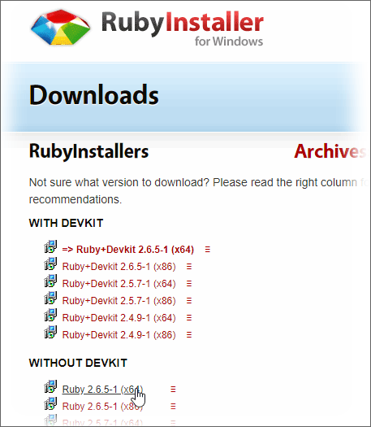
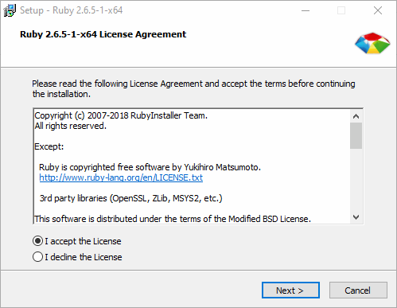
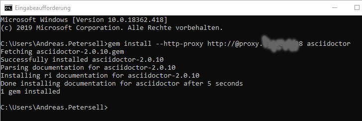
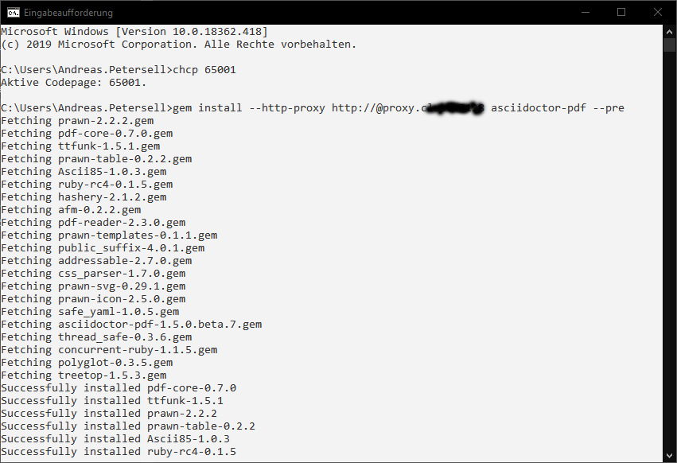

AsciiDoc ist eine vereinfachte Auszeichnungssprache ähnlich Markdown, die dazu dient, Texte in verschiedenen Dokumentenformaten zu veröffentlichen. Asciidoc wurde speziell für die Technische Dokumentation entwickelt und wird in vielen Git-Portalen als Dokumentationsstandard genutzt. Es hat jedoch nicht die Möglichkeiten der Wiederverwendung wie DITA-XML. Neuer Rechner, neuer Doktor: wie muss ich ihn installieren? Jetzt schreibe ich es auf, denn ich vergesse es jedes Mal.
<!--more-->


### Ruby installieren


Der Installationsroutine folgen.



### Asciidoctor installieren

Öffnen Sie eine Eingabeauforderung und geben Sie folgenden Befehl ein und drücken Sie [Enter].

```shell
$ gem install --http-proxy http://@proxy.<Proxyservername>.<Port> asciidoctor
```



Arbeiten Sie ohne Proxyserver, genügt ein `gem install asciidoctor`.

### Asciidoctor für PDF installieren

```shell
$ gem install --http-proxy http://@proxy.<Proxyservername>.<Port> asciidoctor-pdf --pre
```



Das war´s. Sie können nun mit Hilfe von adoc-Dateien  [Output erzeugen](https://asciidoctor.org/docs/user-manual/#html).

```shell
$ asciidoctor mysample.adoc
```