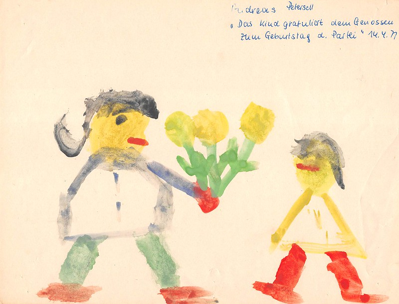

In der DDR mußten fast immer beide Elternteile arbeiten, um ausreichend Geld zu verdienen. Nur die wenigsten Frauen waren Hausfrauen. So ging ich mit 3 Jahren in den Kindergarten: von 1969 bis 1973. Zur Erinnerung: Walter Ulbricht tritt am 3. Mai 1971 als Erster Sekretär des ZK zurück. 1973 stirbt er im Alter von 80 Jahren. Der neue Mann heißt Erich Honecker.
<!--more-->

Mein Berliner Kindergarten befand sich im Treptower Ortsteil Johannisthal in der Nieberstraße. Johannisthal grenzte an die Berliner Mauer. Das Wachregiment "Felix Dzerzynski" befand sich in Adlershof und somit nicht allzuweit entfernt.

### Zeichenmappe

In jedem Kindergarten wird viel gezeichnet. Egal wo und in welcher Gesellschaftsform. Das bemerkenswerte an meiner Zeichenmappe war, dass sie

1. erst mit Abschluss des Kindergartens meinen Eltern überreicht wurde. Sie war vollständig! Nichts ging verloren oder vergessen.
1. und in einer Diktatur entstand. Wie hoch war eigentlich der Anteil an Zeichnungen, die direkt sozialistische Ideologie oder DDR-Devotionalien zum Thema hatten? Wann stand die Mutter im Mittelpunkt? Ein jeder kann sich ein Bild machen, denn ich habe die Zeichnungen mit Tags versehen (s.u.).

Sämtliche 106 Zeichnungen befinden sich in einem Flickr-Album [DDR-Kinderzeichnungen](https://www.flickr.com/photos/petersell/albums/72157659231409280).

### Lizenz

Dieser Text und sämtliche Fotos von Andreas Petersell stehen unter einer [Creative Commons Namensnennung  4.0 Deutschland](https://creativecommons.org/licenses/by/4.0/) Lizenz.

Sie dürfen das Werk bzw. den Inhalt vervielfältigen, verbreiten und öffentlich zugänglich machen, Abwandlungen und Bearbeitungen des Werkes bzw. Inhaltes anfertigen und das Werk kommerziell nutzen. Einzige Bedingung: Namensnennung. Sie müssen den Namen des Autors/Rechteinhabers **Andreas Petersell** nennen.

### Tags

Ich habe die Zeichnungen mit verschiedenen Tags versehen. Dadurch sind die Zeichnungen unter einem bestimmten Stichwort über eine URL aufrufbar. Einige Zeichnungen wurden mit mehreren Tags versehen.

#### kitakunstddr

1. [Zur Sammlung](https://www.flickr.com/search/?text=kitakunstddr)
1. DDR-Devotionalien wie die "Arbeiterfahne" stehen im Mittelpunkt.
1. 11 Zeichnungen

#### kitakunstmama

1. [Zur Sammlung](https://www.flickr.com/search/?text=kitakunstmama)
1. Die Mutter steht im Mittelpunkt.
1. 14 Zeichnungen

#### kitakunstpapa

1. [Zur Sammlung](https://www.flickr.com/search/?text=kitakunstpapa)
1. Der Vater steht im Mittelpunkt, oder besser: er ist mit drauf.
1. 1 Zeichnung

#### kitakunstsaison

1. [Zur Sammlung](https://www.flickr.com/search/?text=kitakunstsaison)
1. Die Jahreszeiten sowie Ostern und Weihnachten stehen im Mittelpunkt.
1. 18 Zeichnungen

#### kitakunstnatur

1. [Zur Sammlung](https://www.flickr.com/search/?text=kitakunstnatur)
1. Das Blümchen oder der Baum stehen im Mittelpunkt.
1. 11 Zeichnungen

#### kitakunstselbstbildnis

1. [Zur Sammlung](https://www.flickr.com/search/?text=kitakunstselbstbildnis)
1. Der kleine Künstler selbst steht im Mittelpunkt. Da dürfen auch schon mal Familienmitglieder mit rauf.
1. 7 Zeichnungen

#### kitakunstmaltechnik

1. [Zur Sammlung](https://www.flickr.com/search/?text=kitakunstmaltechnik)
1. Die Maltechniken wie Schneiden und Kleben, Ausreißen, Stempeln, abstrakte Farbkombinationen und Kollagen.
1. 19 Zeichnungen

#### kitakunstvorlage

1. [Zur Sammlung](https://www.flickr.com/search/?q=kitakunstvorlage)
1. Ein ganz bestimmtes Thema oder ein Modell wurde vorgeben.
1. 22 Zeichnungen