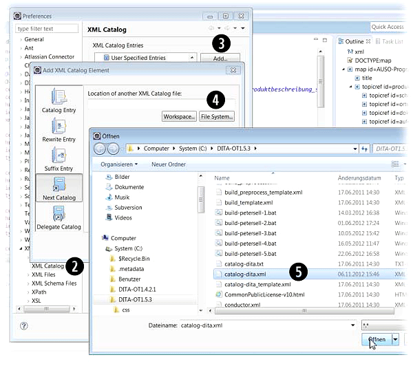

Eclipse eignet sich gut als Quelldateien-Editor. Damit die DITA-Dateien validiert werden können, gilt es, die DTDs einzubinden.
<!--more-->

> [!tip] Voraussetzung
> Sie müssen das Java JDK und Eclipse installiert haben. Ein Java JRE war in meinem Fall nicht ausreichend.

1. Klicken Sie in Eclipse auf _Window > Preferences_.
1. Öffnen Sie die Menüverzeichnisbaum unterhalb _XML_ und klicken Sie auf _XML Catalog_.
1. Klicken Sie im Fenster _Preferences_ auf _Add_.
1. Klicken Sie auf _Next Catalog_ und anschließend auf _File System_.
1. Springen Sie im Fenster _Öffnen_ auf die Datei `catalog-dita.xml` im Hauptverzeichnis Ihres aktuellen DITA Open Toolkits.