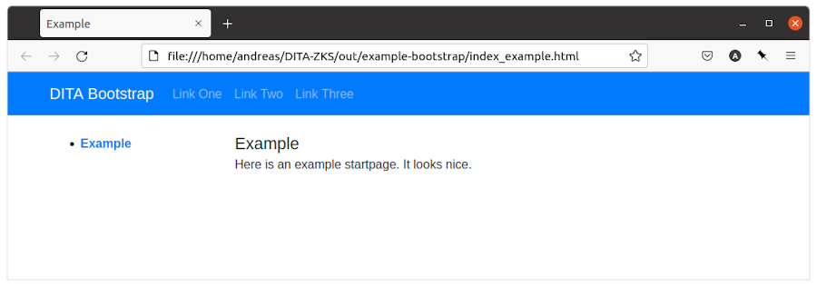

Sie generieren DITA-Output mit Hilfe eines DITA-OT-Images. Aber wie generieren Sie Output mit Hilfe eines Plugins, dass nicht in das DITA-OT standardmäßig integriert ist?
<!--more-->


### Quellen

Diese Quelle ermöglichten mir diesen Artikel:

* [Installing plug-ins in a Docker image](https://www.dita-ot.org/dev/topics/creating-docker-images.html)
* [DITA Bootstrap](https://github.com/infotexture/dita-bootstrap)

### Kontext

Mein Sohn hat mir einen neuen Rechner aufgebaut - mit Linux! Nun mußte ich sämtliche Programme neu installieren. Muss ich? Ich stieß innerhalb der DITA-Dokumention auf den Artikel [Running the dita command from a Docker image](https://www.dita-ot.org/dev/topics/using-docker-images.html). Inzwischen gelingt es mir, mit Hilfe eines DITA-OT-Images Standard-HTML-Output zu generieren.

Aber ich möchte das Aussehen verändern mit Hilfe des Plugins [DITA Bootstrap](https://github.com/infotexture/dita-bootstrap) von Roger W. Fienhold Sheen. Dafür hat letzterer [eine Anleitung](https://www.dita-ot.org/dev/topics/creating-docker-images.html) in der offiziellen Dokumentation geschrieben.

### Anleitung

> **Tip — Voraussetzung**
>
> Sie haben Docker installiert.

#### Dockerfile erstellen

Erstellen Sie innerhalb Ihres DITA-XML-Quelldateien-Ordners eine neue Textdatei mit Namen `Dockerfile`. Schreiben Sie folgendes hinein:

**Dockerfile im Quelldateien-Ordner**

```xml
# Use the latest DITA-OT image as parent:
FROM ghcr.io/dita-ot/dita-ot:3.6.1
# Install a custom plug-in from a remote location:
RUN dita --install https://github.com/infotexture/dita-bootstrap/archive/3.4.1.zip
```

#### Docker-Image bauen

Auf der Grundlage der Datei `Dockerfile` wird jetzt ein Image erstellt. Öffnen Sie ein Terminal-Fenster und gehen Sie in Ihr DITA-Quellverzeichnis, weil darin sich Ihre `Dockerfile` befindet. Geben Sie folgenden Befehl ein:

**Buildfehl auf Konsole**

```xml
docker image build -t ditaot-bootstrap-docker-image:1.0 .
```

Sie können Ihrem Image natürlich einen anderen Namen vergeben als _ditaot-bootstrap-docker-image_. Ihre Ausgabe könnte so ähnlich aussehen:

**Ausgabe auf Konsole**

```xml
Sending build context to Docker daemon  2.048kB
Step 1/2 : FROM ghcr.io/dita-ot/dita-ot:3.6.1
 ---> 9abb96827538
Step 2/2 : RUN dita --install https://github.com/infotexture/dita-bootstrap/archive/3.4.1.zip
 ---> Running in d510f874cae0
Added net.infotexture.dita-bootstrap
Removing intermediate container d510f874cae0
 ---> 63deb8e15b5b
Successfully built 402885636b7f
Successfully tagged ditaot-bootstrap-docker-image:1.0
```

#### Container starten für den Build

Jetzt haben Sie ein Image erstellt, dass das DITA-OT enthält, in dem wiederum ein Plugin _DITA-Bootstrap_ installiert wurde. Um HTML-Output zu erhalten, müssen Sie dem Image einen DITA-Buildbefehl übergeben. In diesem Zuge wird aus dem Image ein Container gestartet inklusive Buildbefehl.

Geben Sie folgenden Befehl im Terminal-Fenster ein:

**Docker-Befehl auf der Konsole**

```xml
sudo docker container run -it \
  -v /home/andreas/DITA-ZKS:/src ditaot-bootstrap-docker-image:1.0 \
  -i /src/zks.ditamap \
  -o /src/out/dita-bootstrap \
  -f html5-bootstrap -v
```

Passen Sie Ihren DITA-Quelldatei-Ordner entsprechend an. Bei mir ist folgender Pfad gegeben: `/home/andreas/DITA-ZKS`. Falls Sie einen anderen Image-Namen statt _ditaot-bootstrap-docker-image_ gewählt haben, so müssen Sie den Ihrigen vermerken. Ebenso heißt meine ditamap-Datei _zks.ditamap_. Passen Sie hier Ihren Dateinamen an.

[caption="Abb. 1: "]


Nach dem Docker-Run-Befehl füllte sich mein output-Ordner `out` mit den gewünschten HTML-Seiten - jetzt aber im Bootstrap-Look des Plugins.
