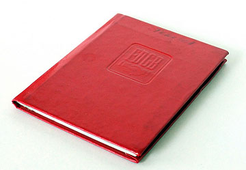
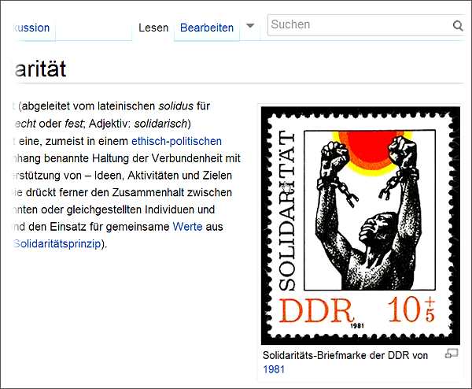

Den FDGB-Ausweis besaß jeder Werktätige der DDR. Und vielleicht liegt er heute noch in den Schubladen vieler Ostdeutscher. Noch vor wenigen Jahren war er ein Vehikel für ein monatliches Ritual: dem Kleben einer sogenannten Solidaritätsmarke. Na und?
<!--more-->

*Abb. 1: Das Ausweisbüchlein*

Eine kleine Marke mit sinnfreiem Aufdruck sorgt für ein flächendeckendes Unterwerfungsritual im Land.

### Die Sprache der Macht

Jeder Mensch erfährt in seinem Alltag die Sprache der Macht. Entweder nutzt man sie selbst oder muss sie hören, wenn der Gegenüber seine Dominanz signalisiert. Letzterer nun bewußt oder unbewußt. Darüber schreibt Matthias Nölke in seinem Buch _Die Sprache der Macht: Wie man sie durchschaut. Wie man sie nutzt._ Der Leser erhält Beispiele und rhetorische Tipps zum Gebrauch der Machtsprache und zum Durchbrechen des Dominanzstrebens des Gegenübers. Auch er spricht aus, was wir alle schon ahnten:

> Nach Macht in irgendeiner Form streben wir alle. Wer Macht hat, kann nach eigenen Vorstellungen gestalten und auf andere Menschen einwirken. Und das ist eine zutiefst beglückende Erfahrung - für jeden von uns. Ja, unsere seelische Gesundheit hängt unter anderem davon ab, dass wir unser Tun als wirksam empfinden, dass wir eben nicht ohnmächtig alles über uns ergehen lassen müssen. Hin und wieder verschaffen wir alle uns dieses Glück über ein "kleines Machterlebnis" - auch so charakterlich integre Menschen wie Sie und ich.[^1]

Nicht immer wird die Sprache der Macht bewußt gesprochen. Ein sehr oft verbreiteter Satz ist der des Geschäftsführers einer Firma: "Meine Tür steht immer offen".

In einem Interview mit der Berliner Zeitung wird Erich Sixt befragt:

> Warum gibt es bei Sixt eingentlich keinen Betriebsrat?
>
> Unsere Mitarbeiter werden überdurchschnittlich gut bezahlt, sie sind am Erfolg beteiligt. Und wir haben bei Sixt
> flache Hierachien und das Prinzip der offenen Tür.[^2]

Es geht nicht um eine moralische Bewertung des Fakts, dass es keinen Betriebsrat bei Sixt gibt. Meine Erfahrung ist sogar, dass je stärker eine Gewerkschaft in einer Firma vertreten ist, desto mehr Mitarbeiter mit Zeitarbeitsvertrag oder gar Werkvertrag gibt es.

Wenn der Arbeitnehmer seine Tür offen hält, kommt vielleicht frische Luft rein. Mehr nicht.

### Die Vergottung der Macht

Die Sprache der Macht innerhalb totalitärer Staaten wird oftmals als Propaganda etikettiert. Doch so einfach ist es damit nicht getan:

> In Diktaturen dominiert der direktive Sprachmodus mit Anordnung, Befehl und Drohung. Selbst der Gestus der Propaganda ist zwar auf der Oberfläche persuasiv, in der Substanz aber direktiv. Denn für Machterhalt, der sich auf Gewaltmittel stützt, ist es unerheblich, ob Propaganda die Menschen wirklich überzeugt. Wichtiger ist, dass die eigene Ideologie- und Propagandasprache in der öffentlichen Kommunikation monopolisiert und zum Zulassungskriterium für Karrieren wird.[^3]

Die Propaganda-Sprache gab ein einfaches Orientierungssystem ab: wer sie gebrauchte, glaubte entweder daran und war demzufolge einfach gestrickt, oder er gebrauchte sie mit Kalkül. In beiden Fällen war der Umgang mit diesen Menschen gefährlich.

In seinem Essay _Die Kunst des Romans_ beschäftigt sich Milan Kundera mit den Romanen Kafkas. "Kafkas erste Interpreten haben seine Romane ... als religiöse Parabeln gedeutet." Dem wiederspricht er, um fortzufahren:

> überall, wo die Macht sich vergottet, schafft sie sich automatisch eine eigene Theologie; überall, wo sie als Gott auftritt, ruft sie religiöse Gefühle wach; die Welt kann mit einem theologischen Vokabular beschrieben werden.[^4]

Der Begriff _Solidarität_ war ein wesentlicher Terminus in der Theologie des SED-Regimes. Wer erst einmal an das SED-Regime und dessen Theologie glaubt, braucht keine Objekte im Satzbau wie _Mit wem übe ich Solidarität?_ und _In welcher Angelegenheit?_ Nichtgläubige haben diese Angaben schmerzlich vermißt, denn so ein erlerntes Sprachgefühl sitzt tief. Wer _Solidarität_ sagt, muss auch sagen, mit wem diese geübt werden soll. Alles andere ist Theologie und zeugt genau von der Abwesenheit von Solidarität.

*Abb. 2: Den Wikipedia-Eintrag zur Solidarität schmückt eine fragwürdige Briefmarke*

Aber auch mit nachfolgenden Objekten ist der Gebrauch von Solidarität fragwürdig. Ulrich von Alemann polemisiert:

> Begriffe verbrauchen sich, nutzen sich ab, werten sich um, werden umgewandelt und abgewertet. Sie leben: Und deshalb dürfen sie auch sterben, erlöst nach langer Bedeutungsschwindsucht. Die staatliche Verordnung von Solidarität hat dem Begriff endgültig den Todesstoß gegeben. Solidarität übt jetzt endlich jeder Steuerzahler. Denn sie erscheint als steuerliche Zwangsabgabe zur Finanzierung der deutschen Einheit monatlich auf unserem Gehaltszettel.[^5]

### Die Seiten des Ausweises

Die Fotos und Scans können Sie sorgenfrei nutzen. Sie stehen unter einer Creative Commons Lizenz. 16 Fotos auf medium.com  [Fotoalbum](https://medium.com/@Petersell/fc361f5ca770)

[^1]: Matthias Nölke, Die Sprache der Macht: Wie man sie durchschaut. Wie man sie nutzt, Freiburg 2010, S. 9
[^2]: Der Ehrbare Kaufmann stirbt aus. Interview mit Erich Sixt, Berliner Zeitung vom 4./5. Mai 2013, S. 10
[^3]: Josef Klein, Sprache und Macht, in: APUZ (Aus Politik und Zeitgeschehen) 8/2010, Bonn 2010
[^4]: Milan Kundera, Die Kunst des Romans, Frankfurt am Main 1989, S. 112
[^5]: Ulrich von Alemann, Solidarier aller Parteien - verschont uns! Eine Polemik, Bonn 1996, Gewerkschaftliche Monatshefte 11-12/1996, S. 756
