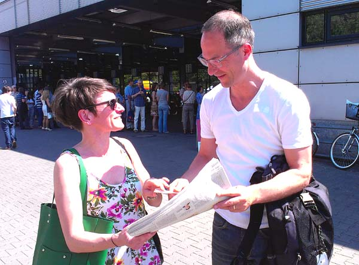

Mein Schatz hat immer gute Ideen. Manchmal hat das nichts mit Shopping zu tun. Wir fahren in die Druckerei der Berliner Zeitung nach Lichtenberg zum dortigen Leserfest "70 Jahre Berliner Zeitung".
<!--more-->

Da hängt sie nun jeden Morgen, unsere Zeitung und fährt kilometerweise Seilbahn. Nur damit sie trocknet. Unser HERR möchte dort später arbeiten. Aber wohl nur wegen der vielen Knöppe.

"Hallo, Guten Tag, ich bin von der Berliner Zeitung. Darf ich Sie fotografieren?" Und so bin ich heute, 2 Tage später, in der Zeitung.

Mein Schatz hatte es nicht so eilig wie ich, nach Hollywood zu kommen. Sie lehnte das Fotoshooting ab.

Aber zum Schluss lief uns noch ein richtiger Star vor die Kamera. Hier gibt Jochen-Martin Gutsch einer Leserin gerade ein Autogramm.

