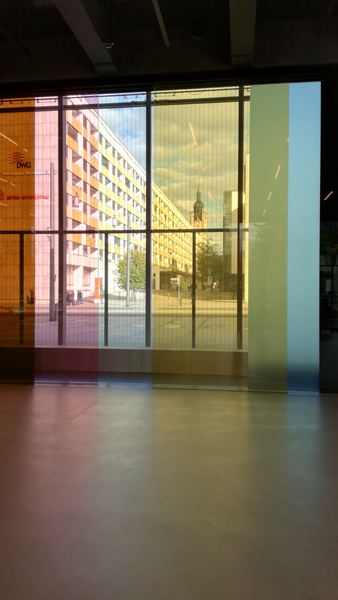

Wir waren mit Freunden in Dessau: 100 Jahre Bauhaus. Natürlich stand auch das neue Bauhaus-Museum auf dem Programm. Ein entspannter Tag, da wir mit dem Berlin-Brandenburg-Ticket unterwegs waren.
<!--more-->

Leider wird dies mein letztes Instagram-Bild. Die automatische Veröffentlichung von Instagram-Fotos auf meiner Webseite petersell.com funktioniert nicht mehr. Webmentions ua. werden von Instagram geblockt. Ich kann nicht mal mehr meine Fotos von Instagram downloaden. Der Nutzer hat keine Rechte an seinen Fotos. Danke, das war´s.