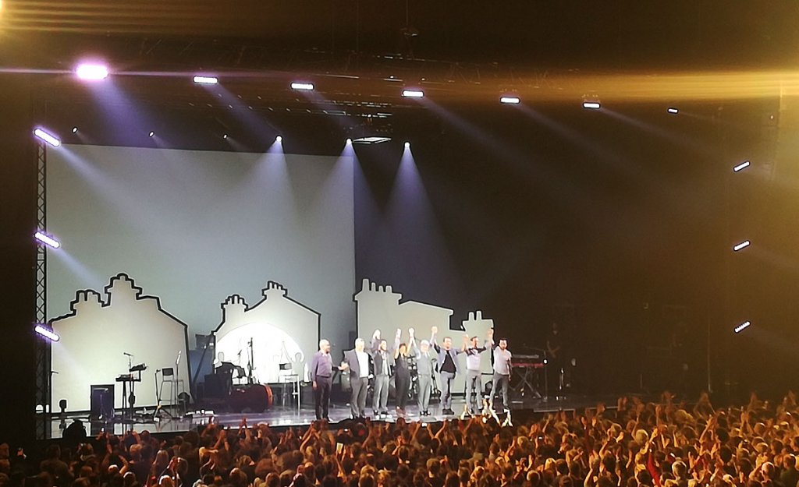

die Max-Schmeling-Halle. Neben den Paris-Songs kamen Balladen und als Rockssongs interpretierte Recto-Verso-Songs zur Aufführung. Alle hatten den Text von _Je veux_ vergessen - und ZAZ gab gottseidank vor: _LA LA, LA LA_ ... Erstaunlich, wie eine Stimme eine ganze Halle füllt. Das Warten bis 21:30 Uhr hatte sich gelohnt.
<!--more-->

